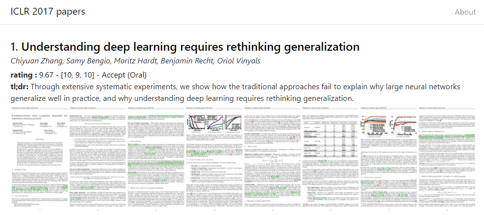

# ConfViews

Generate bird's-eye views of conference proceedings.

:link: https://www.confviews.com

### How to add a new conference?

For example, in order to update the website with Neurips2050, do:
1. Update `config.py`. Add a key `neurips2050` to the dictionary and provide the required templates to be able to query data from OpenReview. 
Data in OpenReview are represented as *notes*. 
To query them, you have to specify an *invitation*. You need to add an `invitation` to get all submissions, and invitation templates for getting decision and rating information for ecah paper. The patterns may differ between years. Check the notebook `opnenreview_api_sandbox.ipynb` that helps with figuring out the required fields.
1. Gather titles, abstracts, and other metadata from OpenReview by running `python get_metadata.py neurips2050`.
1. Generate paper thumbnails by running `python get_thumbs.py neurips2050`.
1. Test the webpage locally by running `python app.py`.
1. Freeze the Flask application into a set of static files by running `python freeze.py`.
### Dependencies

Generating paper thumbnails requires [ImageMagick](https://imagemagick.org/script/download.php). Be sure to tick the installation of legacy utilities (e.g. montage).
Moreover, you need to install [Ghostscript](https://www.ghostscript.com/) in order to rasterize pdfs.

### License

MIT

